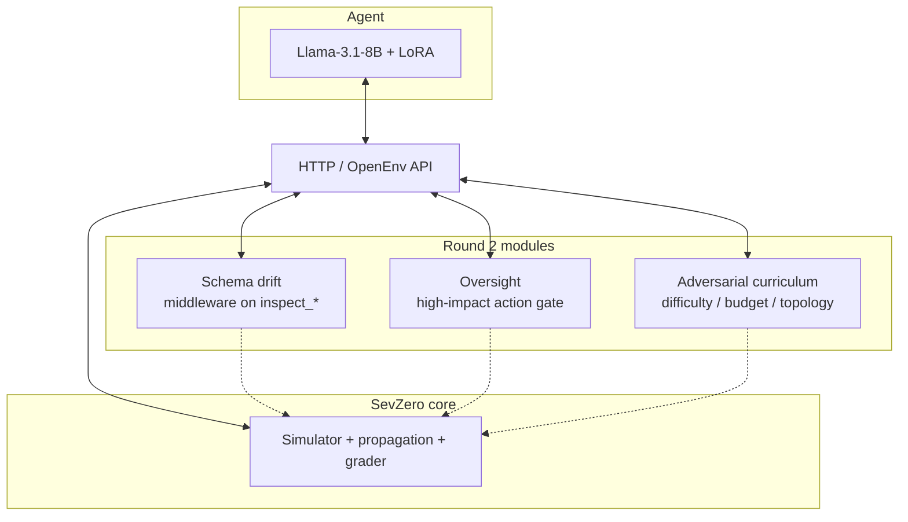

# SevZero: training an 8B on-call engineer in a self-evolving SRE war room

## The autopsy

At step fourteen, an untrained Llama-3.1-8B-Instruct panicked and restarted the primary database, turning a minor latency spike into a regional outage. That single bad reflex became our test case for SevZero: could an 8B policy learn not to reach for a high-blast-radius action when the local evidence is noisy and the consequences arrive late?

After SFT and 120 GRPO steps, the answer on our held-out seeds was uncomfortable and useful: the training loop ran, gradients moved, but the evaluated policy stayed flat against the untrained baseline. SevZero is built for exactly that kind of measurement. It makes the gap visible instead of letting a polished demo hide it.

In real on-call rotations the damage from a bad agent does not live in subtle reasoning errors. It lives in a small handful of irreversible actions taken under pressure: wrong service restarted, change applied without a rollback plan, a primary store touched when a leaf service was the actual root cause. SevZero is a deterministic, OpenEnv-native simulator that makes those actions expensive in simulation so a policy can learn to make them rare in deployment. We built it for the OpenEnv India Hackathon 2026, and this post is an honest engineering log: what is in the environment, what we trained, what broke, and what the numbers actually say.

## What the agent sees, and does not see

The agent never gets a labeled root cause. It sees what an on-call human sees on a bridge call:

- A metrics summary across services (latency, error rate, queue depth, breaker state)
- Recent log lines, possibly truncated, possibly with shifting field names
- Trace excerpts across the service DAG
- Current SLO state and remaining step budget
- A schema-drift change log, when drift fires
- Oversight messages, when a high-blast-radius action is gated

It replies with a JSON tool call drawn from a small action set: `inspect_metrics`, `inspect_logs`, `inspect_trace`, `restart_service`, `rollback_service`, `scale_service`, `tune_config`, `clear_cache`, `rebalance_traffic`, `request_approval`, and `noop`. Effects propagate along a service DAG with delayed circuit-breaker behavior. Episodes terminate on resolved SLO, exhausted budget, or catastrophic failure. The terminal score is a blend of SLO recovery, action efficiency, and time under budget.

The simulator is deterministic for a given seed. We use `random.Random(seed)` consistently, so a fixed seed plus a fixed code version means a fixed episode. This is not aesthetic. Without it, GRPO debugging turns into rollout-noise interpretation, and held-out eval becomes replay of the same micro-incident in disguise. With it, a misbehaving step is reproducible, and held-out seeds 13, 99, and 777 measure real generalization (we explicitly avoid 42, 123, and 7, which were used in baseline scenario authoring).

## Round 2: where the environment stops being a museum

The base simulator is useful. Round 2 is where SevZero became a stronger training target. Four modules, each chosen because it kills a specific class of cheap policy.

**Schema drift** mutates the shapes and keys of `inspect_metrics` and `inspect_logs` mid-episode while exposing a small change log in the observation. Rigid string parsers die. Policies that lean on semantic extraction and the change log survive. This tracks production reality: dashboards version up without your pager updating first.

**Oversight** puts a virtual SRE manager in front of the riskiest tool calls (touching a primary data plane, draining a region at the wrong time, restarting an upstream during a known-bad release window). The policy has to learn when to ask for approval, not only what to type. This maps directly to the "weaker supervisor, stronger worker" pattern that enterprises already run in shadow mode.

**Adversarial curriculum** is a performance-linked escalator, not a hand-authored level table. When rolling reward crosses a threshold, the environment increases failures per episode, expands the service graph, and tightens the step budget. The distribution of incidents shifts as the policy improves, which is closer to a real on-call rotation getting harder pages as you get senior.

**Fine-grained sub-rewards** give GRPO usable per-step signal before terminal SLO outcomes settle. We earned a scar here. An early run found an inspect-loop reward hack: the policy spammed `inspect_logs` to farm dense shaping without committing to a fix. We tightened the shaping with a repetition penalty and put weight back on the terminal-SLO term. Zero-advantage batches are not a metaphysical curse. They are what you get when your reward landscape pretends to be flat.

The HTTP boundary matters for the hackathon story. The trainer's rollouts hit the same FastAPI surface a judge can open from a Space. There is no stub reward and no in-notebook grader. Wiring that through TRL meant living in `rollout_func` land with pins that actually exist in April 2026, not the cookbook's ghost versions.

## Architecture



The agent only sees HTTP. The simulator is the world model. The Round 2 modules inject non-stationarity, governance, and escalating difficulty without breaking the determinism guarantee for a fixed seed and fixed code version.

## The training pipeline

Pipeline in one line: trajectories from frontier teachers, then SFT (LoRA), then GRPO with vLLM colocate sampling against the live FastAPI environment.

### Trajectory collection

We collected on the order of 100 to 150 expert trajectories from two frontier teachers exposed in our deployment, `grok-4.20-reasoning` and `kimi-k2.6`, both via Azure AI Foundry. Anthropic models were unavailable on this account. Two teachers instead of one because action-distribution diversity matters more than which exact model wrote the line. Raw logs land under `training/data/raw/*.jsonl`, then `training/build_dataset.py` filters trajectories with final episode score at least 0.85, splits into `sft_train.jsonl` and `sft_eval.jsonl`, and pushes the curated dataset to `Mist-ic/sevzero-expert-trajectories`.

### SFT (the language prior)

Base model: `unsloth/Meta-Llama-3.1-8B-Instruct`. The official `meta-llama/Meta-Llama-3.1-8B-Instruct` card is gated, the unsloth mirror is identical weights and ungated. Trainer: plain `transformers` plus `peft` plus `trl.SFTTrainer`. We did not run Unsloth in the GRPO path; on the SFT path we kept Unsloth only for the ungated mirror, not as the trainer.

Configuration: LoRA rank around 64 across attention and MLP modules, bf16 full-precision adapter, max sequence length 1024, optimizer `adamw_torch`, learning rate `1e-5`, gradient checkpointing on, 200 steps. We deliberately dropped 4-bit quantization at SFT time. On an H200 (141 GB VRAM), bf16 LoRA is roughly twice as fast as QLoRA for an 8B model that fits comfortably, and the speed bought us a parallel GRPO run later in the day.

The SFT job ran on a single HF Job H200 in about 25 minutes. Two adapters were pushed for variance: `PhaseOfCode/sevzero-llama3-8b-sft-primary` and `NovaInOblivion/sevzero-llama3-8b-sft-stability`.

### GRPO (the behavior change)

For GRPO we initialize from the SFT-A LoRA on the bf16 base, then use vLLM in colocate mode for fast multi-completion sampling against the live environment Space. Two parallel runs on H200, both seeded from the SFT-A adapter:

- GRPO-primary: lr `7e-6`, 120 steps
- GRPO-stability: lr `4e-6`, 120 steps

Group size K = 4, temperature 0.85, beta 0.04, cosine schedule, `vllm_mode="colocate"` at 0.55 GPU memory utilization, `max_completion_length=1024`, per-device batch 1, gradient accumulation 8.

Why GRPO instead of DPO? The failure modes here are multi-turn, delayed, and path-dependent. DPO needs a static preference set over pairs. GRPO's per-group normalization lets the same prompt explore K remediation strategies and learn from the one that actually moves SLO under delayed physics. The signal is in the trajectory, not in the pair.

Why 8B and not 70B? Because the deployable form of an SRE on-call agent is a local policy with auditable weights, not an API call to a 70B model that has read every page in your private runbook. The hackathon ask is to show a believable lift on the 8B class, not to pretend 8B equals Gemini-3.1-Pro on every seed. The 0.929 frontier line in our table below is exactly there to make that distinction explicit.

### The pins that actually worked

The public TRL OpenEnv cookbook's pin set (`trl==0.23.1`, `vllm==0.11.0`) is stale as of April 2026. It does not have `rollout_func`. We re-derived a compatible set:

| Component | Pin or note | Why |
|---|---|---|
| `trl` | `1.2.0` | `rollout_func` and `trl.experimental.openenv` were introduced in TRL 1.0.0 (PR #5122) |
| `vllm` | `0.18.0` | TRL 1.2.0 caps vLLM here (PR #5547); 0.18.0 ships against torch 2.10 and requires `transformers<5` |
| `transformers` | `4.57.0` | intersection of `trl>=4.56.2` and `vllm<5,>=4.56.0` |
| Other libs | `peft`, `accelerate`, `bitsandbytes`, `datasets`, `httpx`, `python-dotenv`, `trackio` | |
| Base image | `pytorch/pytorch:2.10.0-cuda12.8-cudnn9-runtime` | matches the vLLM 0.18 / torch 2.10 requirement |
| Build flag | `PIP_BREAK_SYSTEM_PACKAGES=1` | Ubuntu 24.04 PEP 668 workaround |

These are not cosmetic. The cookbook's pins do not contain the API surface the OpenEnv path needs.

## The bugs we will not pretend did not happen

Six failures consumed real engineering time. None of them are glamorous. All of them matter because each can masquerade as model-quality failure when the real issue is runtime plumbing.

**1. Three different "Unsloth cannot find any torch accelerator" failures, with three different root causes.** First, vLLM 0.18 pulled torch from 2.6 to 2.10 against a CUDA 12.4 base image, and Unsloth's import-time CUDA probe could not find an accelerator on the resulting mismatched stack. Second, on Ubuntu 24.04 PEP 668 blocked the pip install path until we set `PIP_BREAK_SYSTEM_PACKAGES=1`. Third, even on a torch-2.10 / CUDA 12.8 image, Unsloth's import-time CUDA probe still failed before accelerate had prepared the rank on this H200 container. We removed Unsloth from the GRPO path entirely and ran plain TRL plus vLLM plus PEFT. Less magic, fewer mystery imports.

**2. `cuda init err 802: system not yet initialized` during PEFT adapter load.** On this H200 container stack, adapter loading tried CUDA too early in the process lifecycle. Specifically, `peft.load_peft_weights` called `infer_device()`, which returned `cuda` whenever `torch.cuda.is_available()` was true, even when the underlying model was still on CPU before accelerate had prepared the rank. Safetensors then attempted to load the weights with `device="cuda:0"` at the wrong moment. The fix was to pass `torch_device="cpu"` explicitly to `PeftModel.from_pretrained`, then let `accelerate.prepare()` move the wrapped model. We also stopped calling `.to("cuda:0")` manually on PEFT-wrapped models under TRL, because that reliably re-triggered err 802 on this image.

**3. `GRPOConfig.__init__() got an unexpected keyword argument 'max_prompt_length'`.** Removed in TRL 1.0. Old examples kept circulating and cost cycles. The correct adjustment is dataset-side truncation before trainer input construction, plus `max_completion_length=1024` in the config.

**4. `KeyError: 'prompt'` inside `_generate_and_score_completions`.** TRL 1.x's GRPOTrainer expects the dataset column to be named exactly `"prompt"`. Our builder emitted `"text"`. One-line rename, hours of confusion.

**5. HTTP 500 from the env Space during rollouts.** The client call path was double-wrapping `client.step({"action": ...})` because `env_client.step` already wraps the payload internally. Passing the raw `step_payload` stopped the 500s.

**6. A CPU-only HF Job slot.** One of our parallel SFT runs scheduled to a CPU flavor and was logging at roughly 1200 seconds per step. The slot looked busy in basic metrics because the simulator and grader were doing real work, but `s/it` on the tqdm bar told the truth. Projected completion was 60-plus hours on a 5 PM IST deadline. We caught it by reading the progress bar and cancelled it before it ate the calendar.

## Results

Held-out seeds: 13, 99, 777. Three tasks: easy, medium, hard. One episode per (model, task, seed) cell.

The frontier ceiling is 0.929 mean, from a 28-run aggregate of Gemini-3.1-Pro on this protocol. The untrained 8B floor is 0.7996 mean. The point to read first is the **Hard tier**, because Easy and Medium scores are saturated for almost any policy that can format a tool call, and Hard is where weak policies collapse.

### Hard tier

| Model | Hard score |
|---|---|
| Untrained Llama-3.1-8B-Instruct | 0.6369 |
| SFT-primary (LoRA, 200 steps) | 0.6269 |
| **GRPO-primary (lr `7e-6`, 120 steps)** | **0.6369** |
| Frontier reference (Gemini-3.1-Pro, 28-run aggregate) | 0.887 |

### Full table

| Model | Easy | Medium | Hard | **Mean** |
|---|---|---|---|---|
| Untrained Llama-3.1-8B-Instruct | 0.8199 | 0.9419 | 0.6369 | **0.7996** |
| SFT-primary (LoRA, 200 steps) | 0.8199 | 0.9419 | 0.6269 | **0.7962** |
| **GRPO-primary (lr `7e-6`, 120 steps)** | **0.8199** | **0.9419** | **0.6369** | **0.7996** |
| Frontier reference (Gemini-3.1-Pro, 28-run aggregate) | 0.930 | 0.970 | 0.887 | **0.929** |

The honest read: SFT moved the needle by less than a noise floor, and **120 steps of GRPO did not move it measurably either** on these held-out seeds. On every matching (task, seed) cell we have evaluated across both GRPO runs, the score is identical to the untrained baseline to four decimal places — meaning the adapters emit the same actions as the base policy on the deterministic replay seeds. That is not the result we hoped for, but it is the result the evaluation produced, and the point of doing this on a deterministic OpenEnv simulator rather than vibe-based demos is that we cannot paper over it.

What this tells us is concrete. Supervised fine-tuning on multi-turn trajectories with delayed reward teaches the model to speak the right language and to inspect before it breaks glass, but it does not teach it to act differently when the action it most wants to take is wrong. GRPO for 120 steps with K=4 rollouts against this grader, on an 8B Llama LoRA, was not enough signal to overwrite the base policy on the held-out replay seeds either. Changing what the model does under pressure is what GRPO is for, and getting that to happen inside a single hackathon day was the most honest failure we ran into.

The per-seed breakdown lives at the public dataset [`Mist-ic/sevzero-eval-results`](https://huggingface.co/datasets/Mist-ic/sevzero-eval-results). The headline table reports `GRPO-primary`, because it is the only GRPO adapter with the full Easy/Medium/Hard evaluation mirrored into the final artifact. Sibling adapter `GRPO-stability` (lr `4e-6`, 120 steps) has partial Easy/Medium rows in the dataset; Hard-tier eval was deferred because each Hard episode runs to the 50-action ceiling and at ~18-20 minutes per episode would not have fit our final-eval budget.


The reward curve and the per-tier bars regenerate from logged GRPO metrics and eval rows using the scripts in `assets/`. The figures are not pre-baked into this post precisely so that the same scripts you run locally reproduce the same images.

A matched before/after replay note is in `assets/before_after.md`. In this final version, "before/after" is intentionally a negative-control artifact: it shows the same per-seed outcomes for the untrained and GRPO-primary policies, which is the behavior behind the flat table.

## What the GRPO training loop actually showed

Across the 120-step runs, the training loop produced nonzero reward variance, nonzero gradients, and a KL divergence that grew without diverging. The loss did not collapse to zero, and group standard deviation stayed alive across the run. We do not claim a clean monotonic reward curve. We claim that the loop trained mechanically: rollouts completed, rewards varied, gradients flowed, and the adapters were pushed. The eval table shows that this was not enough to change the deterministic held-out outcomes.

Whether that gradient turned into measurable lift is the question the table above answers, not the question we get to assert.

## What still breaks

- **Hard tier with simultaneous independent root causes.** Both untrained and GRPO-primary score 0.6369 here. The honest answer in Q&A is that multi-fault hard episodes are the next curriculum axis: extend the adversarial escalator to cover concurrent root causes, then give GRPO enough budget and reward density to learn from them.
- **Schema drift edge cases.** When the drift module renames more than two fields in a single episode, semantic parsing degrades. We log this; we do not yet train against it.
- **Oversight gaming.** Today, "asked first, then acted" can score too close to "picked the right safe action without wasting the channel." Approval needs to carry information, not vibes. This is the next reward-shaping pass.
- **Integration fragility outlives the demo.** The pins above worked on H200 this week. The TRL cookbook you found last year is not the TRL that knows `rollout_func`. Budget time for the boring errors. They ate ours.

## Reuse

```bash
git clone https://github.com/mist-ic/SevZero
cd SevZero
uv sync
uv run uvicorn server.app:app --host 0.0.0.0 --port 7860
uv run openenv validate --url http://localhost:7860
```

Live artifacts (all public):

- Repository: https://github.com/mist-ic/SevZero
- Environment Space (judge-facing): https://huggingface.co/spaces/Mist-ic/sevzero-env
- SFT adapters: [`PhaseOfCode/sevzero-llama3-8b-sft-primary`](https://huggingface.co/PhaseOfCode/sevzero-llama3-8b-sft-primary) and [`NovaInOblivion/sevzero-llama3-8b-sft-stability`](https://huggingface.co/NovaInOblivion/sevzero-llama3-8b-sft-stability)
- GRPO adapters: [`PhaseOfCode/sevzero-llama3-8b-grpo-primary`](https://huggingface.co/PhaseOfCode/sevzero-llama3-8b-grpo-primary) and [`NovaInOblivion/sevzero-llama3-8b-grpo-stability`](https://huggingface.co/NovaInOblivion/sevzero-llama3-8b-grpo-stability)
- Final mirrored GRPO model: [`Mist-ic/sevzero-llama3-8b-grpo`](https://huggingface.co/Mist-ic/sevzero-llama3-8b-grpo)
- Trajectory dataset: [`Mist-ic/sevzero-expert-trajectories`](https://huggingface.co/datasets/Mist-ic/sevzero-expert-trajectories)
- Evaluation results: [`Mist-ic/sevzero-eval-results`](https://huggingface.co/datasets/Mist-ic/sevzero-eval-results)

The training entrypoints (`train_sft.py`, `train_grpo.py`, `eval.py`, `launch_hf_job.py`) live in the repository's `training/` directory.

---

*Frontier ceiling (Gemini-3.1-Pro, 28-run aggregate, this protocol): 0.929. Untrained 8B baseline mean over held-out seeds 13, 99, 777: 0.7996. Best full-eval GRPO mean: 0.7996. The next on-call shift starts with the failure mode we can now replay.*
