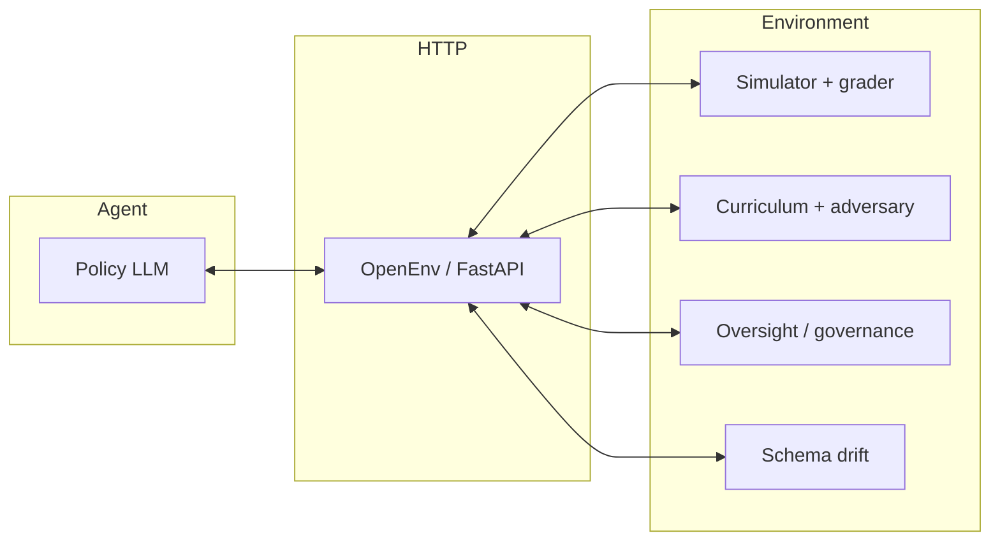
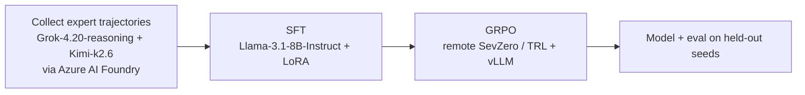

# SevZero

**A self-evolving SRE war-room for training on-call AI agents.**

> At step fourteen, an untrained 8B model panicked and restarted the primary database, turning a minor latency spike into a regional outage. SevZero turns that kind of bad on-call reflex into a deterministic OpenEnv replay, then tests whether training actually changes it.

**Status:** Environment, SFT, and GRPO training all complete and public. Held-out evaluation on seeds 13/99/777: SFT and GRPO are flat vs the untrained baseline — see the [blog post](https://huggingface.co/spaces/Mist-ic/sevzero-env/blob/main/BLOG.md) for the honest read and the per-seed breakdown in [`Mist-ic/sevzero-eval-results`](https://huggingface.co/datasets/Mist-ic/sevzero-eval-results).

In R1 we built the foundation; in R2 we turned it into a self-evolving SRE war-room: live curriculum pressure, schema drift, oversight for risky actions, and a training stack that shows up in reward curves, not just pull requests.

---

## Live artifacts (main hosting)

| | |
|:--|:--|
| **GitHub** | [`github.com/mist-ic/SevZero`](https://github.com/mist-ic/SevZero) |
| **HF Space (environment)** | [`huggingface.co/spaces/Mist-ic/sevzero-env`](https://huggingface.co/spaces/Mist-ic/sevzero-env) |
| **HF Model (SFT-primary adapter)** | [`huggingface.co/PhaseOfCode/sevzero-llama3-8b-sft-primary`](https://huggingface.co/PhaseOfCode/sevzero-llama3-8b-sft-primary) |
| **HF Model (SFT-stability adapter)** | [`huggingface.co/NovaInOblivion/sevzero-llama3-8b-sft-stability`](https://huggingface.co/NovaInOblivion/sevzero-llama3-8b-sft-stability) |
| **HF Model (GRPO-primary adapter, lr 7e-6)** | [`huggingface.co/PhaseOfCode/sevzero-llama3-8b-grpo-primary`](https://huggingface.co/PhaseOfCode/sevzero-llama3-8b-grpo-primary) |
| **HF Model (GRPO-stability adapter, lr 4e-6)** | [`huggingface.co/NovaInOblivion/sevzero-llama3-8b-grpo-stability`](https://huggingface.co/NovaInOblivion/sevzero-llama3-8b-grpo-stability) |
| **HF Model (final mirrored GRPO)** | [`huggingface.co/Mist-ic/sevzero-llama3-8b-grpo`](https://huggingface.co/Mist-ic/sevzero-llama3-8b-grpo) |
| **HF Dataset (trajectories)** | [`huggingface.co/datasets/Mist-ic/sevzero-expert-trajectories`](https://huggingface.co/datasets/Mist-ic/sevzero-expert-trajectories) |
| **HF Dataset (eval results)** | [`huggingface.co/datasets/Mist-ic/sevzero-eval-results`](https://huggingface.co/datasets/Mist-ic/sevzero-eval-results) |
| **Trackio (primary run)** | [`huggingface.co/spaces/PhaseOfCode/trackio`](https://huggingface.co/spaces/PhaseOfCode/trackio) |
| **Trackio (stability run)** | [`huggingface.co/spaces/NovaInOblivion/trackio`](https://huggingface.co/spaces/NovaInOblivion/trackio) |
| **Blog (HF)** | [`huggingface.co/spaces/Mist-ic/sevzero-env/blob/main/BLOG.md`](https://huggingface.co/spaces/Mist-ic/sevzero-env/blob/main/BLOG.md) |

---

## What’s new in R2

| Upgrade | What it does (one line) |
|--------|-------------------------|
| **Schema drift** | `inspect_metrics` / `inspect_logs` payloads and keys can change mid-episode; a change log keeps it fair. |
| **Oversight** | High-impact actions (e.g. primary DB, traffic drain) go through a virtual SRE manager: approve, deny, or ask for a safer plan. |
| **Adversarial curriculum** | As rolling reward crosses thresholds, the simulator adds failures, tightens the step budget, and scales topology difficulty. |
| **Fine-grained sub-rewards** | Dense step-wise signals so GRPO does not collapse into zero-advantage groups when SLO movement is small. |

---

## Architecture (conceptual)



*Source: [`assets/architecture.md`](assets/architecture.md) (mermaid for editing).*

---

## Training pipeline



*Source: [`assets/training_pipeline.md`](assets/training_pipeline.md).*

---

## Results

**Scores** (held-out eval seeds: **13, 99, 777** — not 42/123/7 from baseline).

| Task | Baseline 8B | SFT-primary | GRPO-primary | Frontier (Gemini-3.1-Pro) |
|------|------------|-------------|--------------|----------------------------|
| Easy | 0.8199 | 0.8199 | 0.8199 | 0.930 |
| Medium | 0.9419 | 0.9419 | 0.9419 | 0.970 |
| Hard | 0.6369 | 0.6269 | 0.6369 | 0.887 |
| **Mean** | 0.7996 | 0.7962 | 0.7996 | **0.929** |

SFT and 120-step GRPO produced flat lift on the held-out seeds. The environment, training loop, and eval harness are the contribution; moving the held-out scores likely requires a larger GRPO budget, denser hard-tier rewards, and a curriculum pass aimed at concurrent root causes, which we discuss in the [blog post](https://huggingface.co/spaces/Mist-ic/sevzero-env/blob/main/BLOG.md).

**Reward curve (GRPO)** — regenerate after each run:

```text
python assets/reward_curve.py <path_to_metrics.jsonl> [--baseline 0.7996]
```


**Bar chart (Easy / Medium / Hard)** — from `eval_results.csv` (produced by `training/eval.py`):

```text
python assets/scores_bar.py path/to/eval_results.csv
```


**Before / after** episode behavior: [`assets/before_after.md`](assets/before_after.md). This is a negative-control replay note: it documents the same hard-tier outcome before and after GRPO, matching the flat eval table.

---

## Theme and rubric mapping

| Criterion (weight) | How SevZero satisfies it |
|--------------------|--------------------------|
| Environment innovation (40%) | SRE sim + queueing cascades; R2: drift, oversight, curriculum, sub-reward density. |
| Storytelling (30%) | Autopsy hook, HF blog, README, annotated plots. |
| Reward improvement (20%) | Logged GRPO `metrics.jsonl`, curve + bar + honest flat-result eval table. |
| Pipeline (10%) | SFT to GRPO, TRL `rollout_func`, scripts linked below. |
| *Themes* | World modeling (professional): multi-signal state; long-horizon: Hard tier; self-improvement: curriculum; multi-agent: oversight layer. |

---

## Reproducibility

**Install (local)**

```bash
git clone https://github.com/mist-ic/SevZero.git
cd SevZero
uv sync   # or: pip install -e .
```

**Run the environment**

```bash
uv run uvicorn server.app:app --host 0.0.0.0 --port 7860
```

**Docker (reset to clean env)**

```bash
docker build -t sevzero .
docker run --rm -p 7860:7860 sevzero
```

**OpenEnv check**

```bash
uv run openenv validate
uv run openenv validate --url http://localhost:7860
```

**Training entrypoints** (see repo `training/` after merge): `collect_trajectories.py`, `build_dataset.py`, `train_sft.py`, `train_grpo.py`, `eval.py`. Colab-friendly paths are documented in the training README inside that package.

**Regenerate story plots**

```bash
python assets/reward_curve.py training/outputs/grpo/metrics.jsonl
python assets/scores_bar.py training/outputs/eval_results.csv
```

---

## Cite

```bibtex
@software{sevzero2026,
  title = {SevZero: A Reinforcement Learning Environment for Site Reliability Engineering},
  author = {SevZero Team},
  year = {2026},
  url = {https://github.com/mist-ic/SevZero}
}
```

---

*Frontier ceiling (Gemini-3.1-Pro, 28-run aggregate): **0.929**. Untrained 8B floor (round-1 mean over seeds 13, 99, 777): **0.800** (exact mean **0.7996**; see `metrics.jsonl` + zero-shot eval).*
