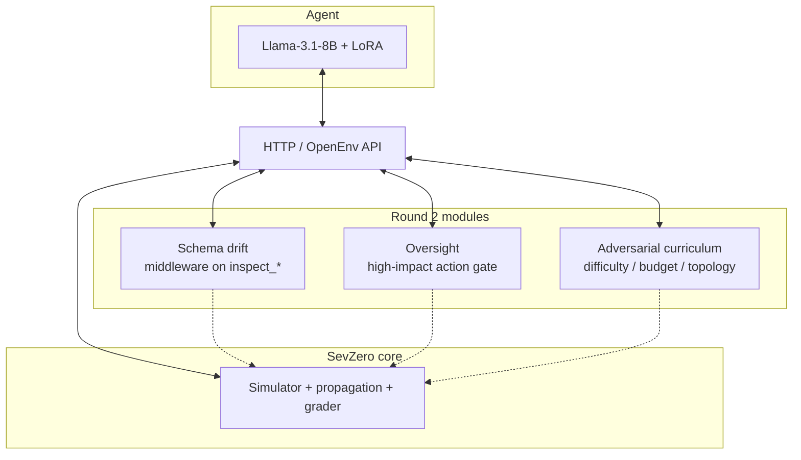

# Architecture diagram (Mermaid)

Use this as the editable source. GitHub and Hugging Face render the same Mermaid subset as `README.md`.

**Narration line:** the agent only sees HTTP; the simulator is the world model; R2 injects non-stationarity (drift), safety (oversight), and harder scenarios (curriculum) without breaking determinism of a fixed seed for the same code version.
