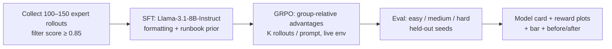

# Training pipeline (Mermaid)

**Why SFT first:** valid JSON actions and a sane inspection-before-remediation style before online RL explores destructive corners.

**Why GRPO over DPO:** the signal is in multi-turn trajectories and delayed SLO effects; group normalization across rollouts for the same context fits TRL + remote OpenEnv without a static preference pair dataset.

**Why 8B:** capacity for long incidents without shipping telemetry to a third-party 70B API in a real SRE deployment; training evidence closes part of the ~0.76 (weak) → 0.929 (frontier) gap on Hard.
